### `pyrobix@github ~ $ whoami`

<table>
  <tr>
    <td valign="top"></td>
    <td valign="top"></td>
  </tr>
</table>

  

### `pyrobix@github ~ $ ./contributions.sh`

  

### `pyrobix@github ~ $ ./projects.sh`

**Automation · Industrial AI · PLC & Robotics · Computer Vision**

<!-- The contribution artwork is regenerated daily by GitHub Actions. -->
