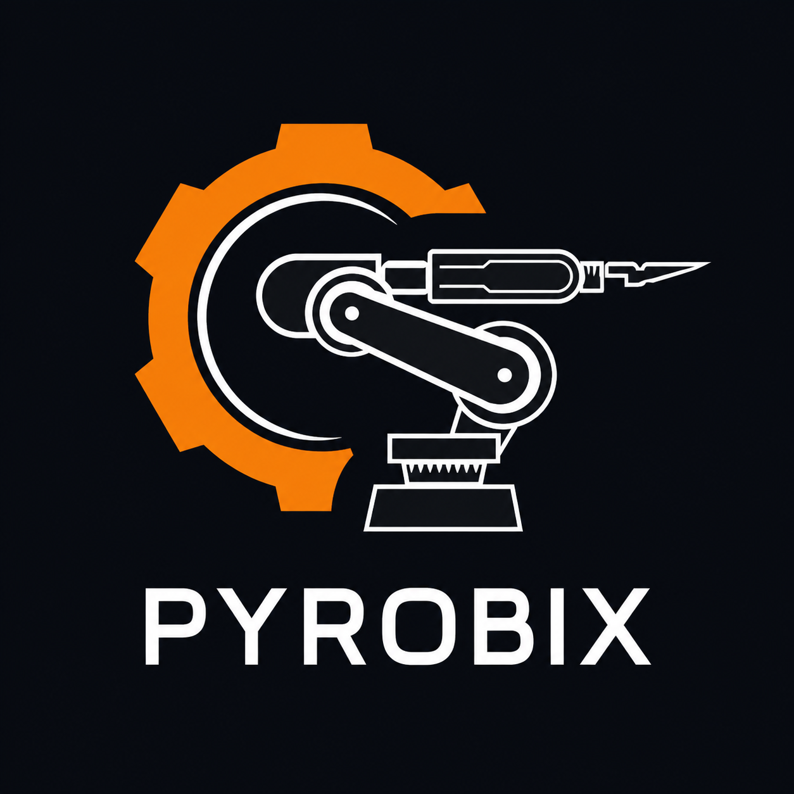

### `pyrobix@github ~ $ ./contributions.sh`

  

### `pyrobix@github ~ $ whoami`

<table>
  <tr>
    <td valign="top"></td>
    <td valign="top"></td>
  </tr>
</table>

 

`Automation` · `Industrial AI` · `PLC & Robotics` · `Computer Vision`

<!-- The contribution artwork is regenerated daily by GitHub Actions. -->
